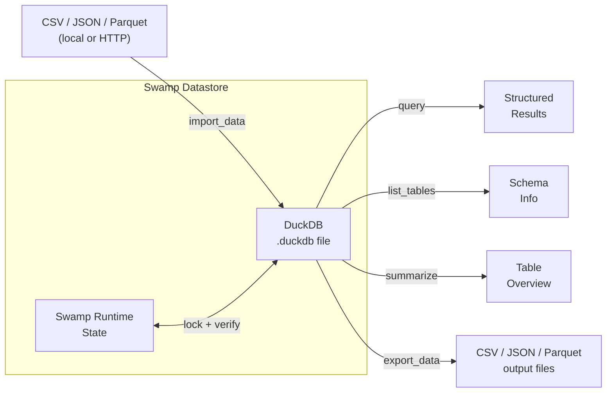
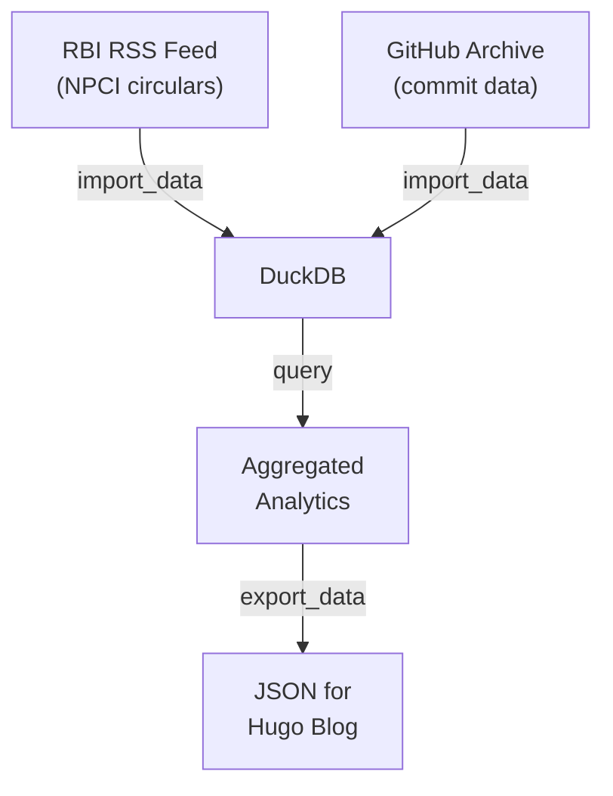

# swamp-duckdb

> **swamp-duckdb** is a [swamp](https://swamp-club.com) extension that turns [DuckDB](https://duckdb.org/) into a first-class query engine and storage backend for swamp workflows. It provides two components: a **model** (five SQL methods for querying, importing, and exporting data) and a **datastore** (an embedded runtime storage backend that replaces swamp's default filesystem store).

---

## What is Swamp?

[Swamp](https://swamp-club.com) is an open-source agent orchestration platform. Extensions add new capabilities — models (tools agents can call), datastores (runtime storage backends), and drivers (external integrations). swamp-duckdb extends swamp with analytical database capabilities.

## What is DuckDB?

[DuckDB](https://duckdb.org/) is an in-process SQL database designed for fast analytical queries. Unlike PostgreSQL or MySQL, it runs embedded — no server to manage, no network overhead. It reads/writes Parquet, CSV, JSON natively. Think "SQLite for analytics."

## Architecture

```
┌─────────────────────────────────────────────────┐
│                   Swamp Runtime                 │
│                                                 │
│  ┌───────────┐         ┌──────────────────┐     │
│  │  Model    │         │   Datastore      │     │
│  │           │         │   Provider       │     │
│  │ ·list_tbls│         │   (swap-in       │     │
│  │ ·query    │         │    backend)      │     │
│  │ ·summarize│         │                  │     │
│  │ ·import   │         │  ┌────────────┐  │     │
│  │ ·export   │         │  │  DuckDB    │  │     │
│  │           │         │  │  embedded  │  │     │
│  └─────┬─────┘         │  │  database  │  │     │
│        │               │  │            │  │     │
│        │               │  │ .locks tbl │  │     │
│        │               │  │ .<tables>  │  │     │
│        ▼               │  └────────────┘  │     │
│  ┌───────────┐         └──────────────────┘     │
│  │  DuckDB   │                                  │
│  │  CLI      │◄───── /path/to/file.duckdb       │
│  │  (v1.4+)  │                                  │
│  └───────────┘                                  │
└─────────────────────────────────────────────────┘
```

## Data Flow



## Method Reference

| Method | Input | Output | Purpose |
|--------|-------|--------|---------|
| `list_tables` | `database` | Table names, columns, types, nullability | Schema inspection |
| `query` | `database`, `sql`, `limit?` | Row data (CSV-parsed) | Arbitrary SQL |
| `summarize` | `database` | Row counts per table | Quick health check |
| `import_data` | `database`, `source`, `table`, `format`, `create_table` | Import stats (rows, columns) | Load external data |
| `export_data` | `database`, `sql` or `table`, `destination`, `format` | Export stats (rows, file path) | Dump query results |

### Supported Formats

| Direction | Formats | Auto-detect |
|-----------|---------|-------------|
| Import | CSV, JSON, NDJSON, Parquet | ✅ from file extension or URL |
| Export | CSV, JSON, Parquet | ✅ from destination extension |

## Datastore Mode

By default, swamp stores runtime data (model outputs, locks, state) on the filesystem. swamp-duckdb provides an alternative backend:

```yaml
# .swamp.yaml
datastore:
  type: "@zocc/duckdb-datastore"
  config:
    database: "/path/to/swamp-data.duckdb"
    schema: "swamp"
```

This creates a single `.duckdb` file containing:
- `swamp.locks` — distributed lock table (nonce-based, with heartbeat keep-alive)
- Runtime directories (audit, telemetry, logs, files) — stored as virtual paths

Use cases for datastore mode:
- **Replicable state** — copy one `.duckdb` file to reproduce swamp state
- **Queryable history** — run SQL against your own agent's runtime data
- **Portable pipelines** — move entire workflow state between machines

## Real-World Use Cases

### 1. Automated Data Pipelines


Pull regulatory data, GitHub events, or any CSV/JSON source into DuckDB. Query, join, aggregate. Export results for content generation.

### 2. Fintech / DPI Analytics
Query stored UPI transaction summaries, Aadhaar authentication logs, or ONDC marketplace data. DuckDB excels at analytical aggregations over millions of rows — perfect for monthly DPI reports.

### 3. Content Operations
Import newsletter subscriber data, article metadata, or engagement metrics. Run SQL to find top-performing content, segment audiences, or generate personalized recommendations.

### 4. Local-First Data Science
No database server needed. DuckDB runs in-process. Import a Parquet file from S3, run window functions, export results. All in one workflow step.

## Installation

```bash
swamp extension pull @zocc/duckdb
```

## Requirements

| Dependency | Version | Notes |
|------------|---------|-------|
| `duckdb` CLI | ≥ 1.4 | [Install](https://duckdb.org/docs/installation/) |
| swamp | latest | [swamp-club.com](https://swamp-club.com) |

## Development

```bash
git clone https://github.com/CCAgentOrg/swamp-duckdb.git
cd swamp-duckdb

# Add as local extension source
swamp extension source add .

# Format check
swamp extension fmt manifest.yaml --check

# Quality check (must pass before publishing)
swamp extension quality manifest.yaml

# Dry-run publish
swamp extension push manifest.yaml --dry-run
```

### Project Structure

```
swamp-duckdb/
├── manifest.yaml                          # Extension manifest
├── query.ts                               # Model: 5 SQL methods
├── datastores/
│   └── duckdb_datastore/
│       └── mod.ts                         # Datastore provider
├── README.md                              # Quick-start + method docs
├── HUMANS.md                              # This file
├── LICENSE.md                             # Apache-2.0
└── .gitignore
```

## Related

| Project | Description |
|---------|-------------|
| [DuckDB](https://duckdb.org/) | In-process analytical database |
| [swamp](https://swamp-club.com) | Agent orchestration platform |
| [swamp-club/extensions](https://swamp-club.com/extensions) | Extension marketplace |
| [@webframp/postgres-datastore](https://swamp-club.com/extensions/@webframp/postgres-datastore) | PostgreSQL datastore (reference implementation) |

## License

[Apache-2.0](./LICENSE.md)
